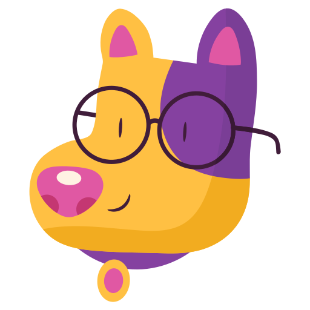

# Oi, eu sou o Bruno...

  

Durante o dia trabalho com desenvolvimento em [Pega](https://www.pega.com/pt-br), uma plataforma de Low-Code geralmente usada para desenhar fluxos de gestão e atendimento de clientes (CRM) ou para processos empresariais (BPM).

No meu tempo livre, procuro estudar algoritmos focando em aplicações relacionadas a games, arte generativa, simulações ou ciência de dados. Esses temas me divertem, e me motivam a explorar conceitos mais clássicos de uma maneira leve. Muitas vezes reproduzindo exemplos de livros e vídeos que me inspiraram, enquanto não encontro minha própria linha autoral.

## Atualmente estudando...

---

<!-- Início da tabela -->

| 🔬&nbsp;&nbsp;&nbsp;**O quê?**                                                                                                                                                       | 🔭&nbsp;&nbsp;&nbsp;**Onde?**                                                                                                                                                                       | 🎨&nbsp;&nbsp;&nbsp;**Como?**                                                                                                                                                                                                                                                                                  |
| ------------------------------------------------------------------------------------------------------------------------------------------------------------------------------------ | --------------------------------------------------------------------------------------------------------------------------------------------------------------------------------------------------- | -------------------------------------------------------------------------------------------------------------------------------------------------------------------------------------------------------------------------------------------------------------------------------------------------------------- |
|       |     | 📖 &nbsp;&nbsp;&nbsp;[Programming Rust, 2nd Edition](https://learning.oreilly.com/library/view/programming-rust-2nd/9781492052586/) 📖 &nbsp;&nbsp;&nbsp;[Hands-on Rust. Effective Learning through 2D Game Development and Play](https://learning.oreilly.com/library/view/hands-on-rust/9781680508796/) |
|  |                          | 🚧 &nbsp;&nbsp;&nbsp;Pendente retormar.                                                                                                                                                                                                                                                                        |
|      |  | 🚧 &nbsp;&nbsp;&nbsp;Pendente retomar.                                                                                                                                                                                                                                                                         |
|                 | 🚧 &nbsp;&nbsp;&nbsp;Pendente retomar.                                                                                                                                                              | 🚧 &nbsp;&nbsp;&nbsp;Pendente retomar.                                                                                                                                                                                                                                                                         |

<!-- Fim da tabela -->

## Alguns locais onde estou...

---

&nbsp;

&nbsp;

&nbsp;

&nbsp;

## Créditos...

---

[Imagem de cão com óculos](https://www.flaticon.com/br/stickers-pack/pets-92)

[Ícones de redes sociais](https://www.iconfinder.com/iconsets/colorful-guache-social-media-logos-1)
